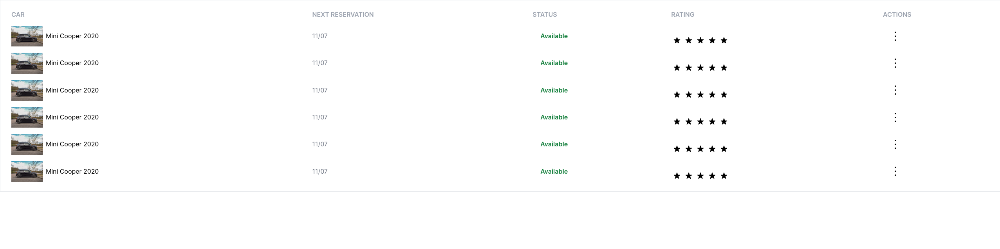

<h1 align="center">TESTE TÉCNICO</h1>

<p align="center">
    
</p>
<p align="center">
  JET SOLUÇÕES WEB </br>
  DESENVOLVEDOR FRONT END JR
</p>

<h3 align="center">Tecnologias usadas:</h3>
<p align="center">
  
  
  
  
  
</p>

### Clone o projeto via SSH:

```
git clone git@github.com:pauloteixeira01/teste-tecnico-desenvolvedor-frentend-jr.git
```

### Faça o download das dependências:

```
yarn
```
> [!CAUTION]
> Não recomendado usar outro gerenciador de pacote.

### Rode o projeto localmente: 
```
yarn dev
```

<h3 align="center">Desktop</h3>

<h3 align="center">Mobile</h3>
